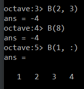
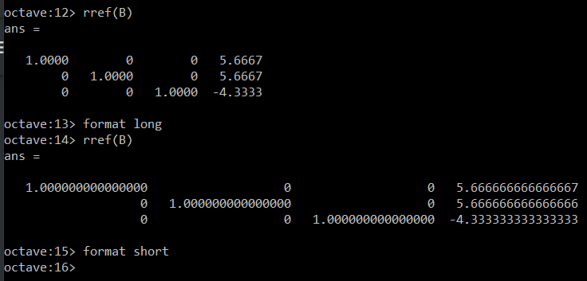
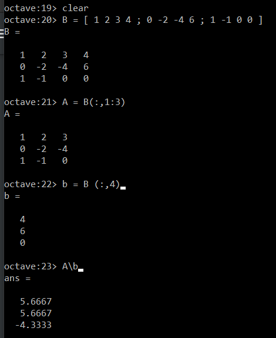
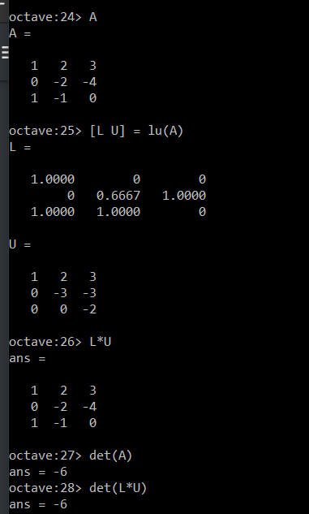
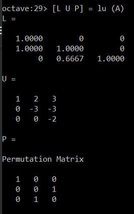
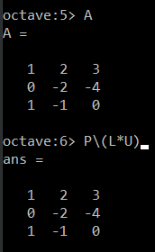

---
# Front matter
lang: ru-RU
title: "Отчёт по лабораторной работе №4"
subtitle: "СЛАУ в Octave"
author: "Сырцов Александр Юрьевич"

# Formatting
toc-title: "Содержание"
toc: true # Table of contents
toc_depth: 2
lof: true # List of figures
lot: true # List of tables
fontsize: 12pt
linestretch: 1.5
papersize: a4paper
documentclass: scrreprt
polyglossia-lang: russian
polyglossia-otherlangs: english
mainfont: PT Serif
romanfont: PT Serif
sansfont: PT Sans
monofont: PT Mono
mainfontoptions: Ligatures=TeX
romanfontoptions: Ligatures=TeX
sansfontoptions: Ligatures=TeX,Scale=MatchLowercase
monofontoptions: Scale=MatchLowercase
indent: true
pdf-engine: lualatex
header-includes:
  - \linepenalty=10 # the penalty added to the badness of each line within a paragraph (no associated penalty node) Increasing the value makes tex try to have fewer lines in the paragraph.
  - \interlinepenalty=0 # value of the penalty (node) added after each line of a paragraph.
  - \hyphenpenalty=50 # the penalty for line breaking at an automatically inserted hyphen
  - \exhyphenpenalty=50 # the penalty for line breaking at an explicit hyphen
  - \binoppenalty=700 # the penalty for breaking a line at a binary operator
  - \relpenalty=500 # the penalty for breaking a line at a relation
  - \clubpenalty=150 # extra penalty for breaking after first line of a paragraph
  - \widowpenalty=150 # extra penalty for breaking before last line of a paragraph
  - \displaywidowpenalty=50 # extra penalty for breaking before last line before a display math
  - \brokenpenalty=100 # extra penalty for page breaking after a hyphenated line
  - \predisplaypenalty=10000 # penalty for breaking before a display
  - \postdisplaypenalty=0 # penalty for breaking after a display
  - \floatingpenalty = 20000 # penalty for splitting an insertion (can only be split footnote in standard LaTeX)
  - \raggedbottom # or \flushbottom
  - \usepackage{float} # keep figures where there are in the text
  - \floatplacement{figure}{H} # keep figures where there are in the text
---

# Цель работы

Ознакомится со способами решения СЛАУ инструментами языка Octave: метод Гаусса, LU-decomposition в методе Гаусса и поиск обратной матрицы.

# Задание

Проделать шаги, указанные в методических материалах и подготовить отчёт.


# Выполнение лабораторной работы

1. Создаём расширенную матрицу `B`, с которой мы будем проделывать преобразования (рис. -@fig:001)

{ #fig:001 width=70% }

2. Пробуем разные подходы обращения к элементам матрицы (рис. -@fig:002):
    1. обращение к индексу на второй строке в третьем столбце.
    2. обращение к элементу 8 работает аналогичным образом, так как научные языки программирования поддерживают возможность использования матриц в качестве таблиц с упорядоченными по столбцам элементами.
    3. обращаемся к первой строке, используя векторный оператор ":" на месте номера столбцов.

{ #fig:002 width=70% }

3. По методу Гаусса в явном виде приводим дополненную матрицу к треугольному виду (рис. -@fig:003):
    1. из строки 3 вычитаем строку 1.
    2. из строки 3 вычитаем строку 2.

{ #fig:003 width=70% }

Так как у нас не получилось обнулить строки, мы можем спокойно переходить к следующему шагу решения, а именно: сокращаем третью строку на 3 и подставляем значение во вторую строку и тд. таким образом получаем вектор-решение

$$ \vec v = 
\begin{pmatrix}
\frac{17}{3} \\ \frac{17}{3} \\ \frac{-13}{3}
\end{pmatrix}.
$$

4. Эквивалентное решение можно получить стандартными средствами языка, используя функцию `rref()`. Выводиться дополненная единичная матрица (рис. -@fig:004)

```octave
  format long % отображаем не менее 15 символов после запятой

  format short % отображаем не более 5 символов после запятой
```

{ #fig:004 width=70% }

5. Теперь решаю СЛАУ методом левостороннего деления, или методом нахождения обратной матрицы. метод заключается в нахождении матрицы обратной к матрице системы и левостороннему домножению обеих частей матречного уравнения на неё. К счастью все эти действия сводятся к операции левостороннего деления, которая самостоятельно проводит необходимые действия и выводит в ответ значение вектора неизвестных, то есть вектор-решение системы (рис. -@fig:005)

{ #fig:005 width=70% }

6. LU-декомпозиция – метод используемый в методе Гаусса. L – lower triange matrix, U – upper triangle matrix. Раскладывая матрицу системы таким образом достаточно решить следующие выражения прямой и обратной подстановкой соответственно.

$$ U * \vec x = \vec y $$
$$ L * \vec y = \vec b $$

Реализация разложения матрицы в языке Octave выглядит просто и не требеут особых действий: достаточно применить к конвектору (объекту вектору) с переменными `L` и `U` инициализацию функцией `lu()` (рис. -@fig:006). На этом же рисунке деманстрирую свойства получившихся матриц. Без наличия матрицы перестановок Octave записывает матрицу L без перестановок строк.

{ #fig:006 width=70% }

7. Аналогичным образом находим LUP-декомпозицию. Различие методов в наличии матрицы перестановок `P`. (рис. -@fig:007).

{ #fig:007 width=70% }

Последним шагом проверяю свойства разложения (рис. -@fig:008).

{ #fig:008 width=70% }

# Выводы

Мне удалось применить основные приёмы решения СЛАУ в языке Octave, представленных в лабораторной работе.
